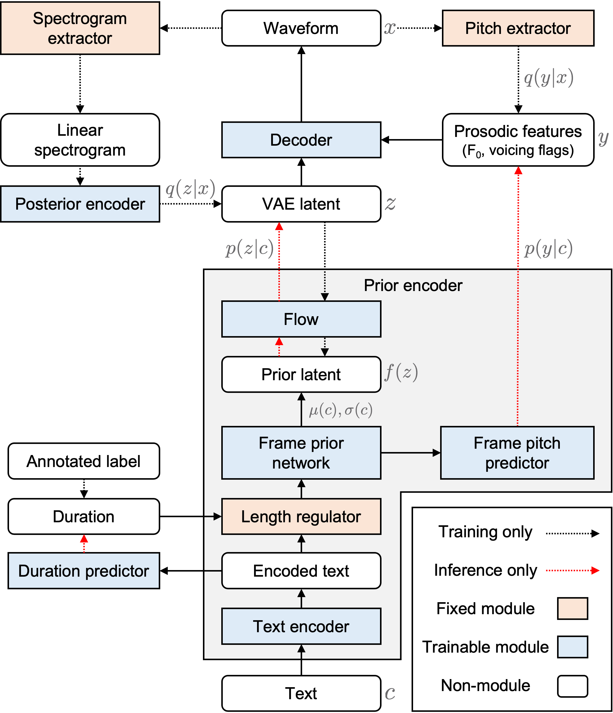

# period_vits_demo
---
title: PERIOD VITS\: VARIATIONAL INFERENCE WITH EXPLICIT PITCH MODELING FOR END-TO-END EMOTIONAL SPEECH SYNTHESIS
layout: default
---

# Authors
- Yuma Shirahata
- Ryuichi Yamamoto
- Eunwoo Song
- Ryo Terashima
- Jae-Min Kim
- Kentaro Tachibana

# Paper
- Submitted to ICASSP 2023
- arXiv: TBD

# Abstruct

Several fully end-to-end text-to-speech (TTS) models have been proposed and showed better performance over cascade models (i.e., training acoustic model and vocoder separately).
However, it often generates unstable pitch contour with audible artifacts when the dataset contains emotional attributes, i.e., large diversity of pronunciation and prosody.
To address this problem, we propose Period VITS, a novel end-to-end TTS model that incorporates an explicit periodicity generator.
In the proposed method, we introduce a frame pitch predictor that enables to predict prosodic features such as pitch and voicing information from the input text.
From these features, the proposed periodicity generator produces a sample-level sinusoidal source that can give the prosodic variations to the decoder.
Finally, the entire model is jointly optimized in an end-to-end manner with variational inference and adversarial objectives.
As a result, the decoder becomes capable to generate more stable, expressive and natural output waveforms.
Experimental results showed that the proposed model over-performs baseline models in terms of naturalness with improved pitch stability in the generated samples.

# Demo

## TTS system

- **VC model:** Scyclone \[1\]
- **Acoustic model:** FastSpeech 2 \[2\]
- **Neural vocoder:** Harmonic-plus-noise Parallel WaveGAN \[3\]

## Models

<!-- TODO: Add the table in paper -->

## Audio samples (Japanese)

### Target speaker's reference

### Neutral style

| Model            | Sample 1 (Female)             | Sample 2 (Male)            |
|------------------|:--------------------:|:-------------------:|
| **Reference**       | <audio controls src="./data/samples/fmkm_neu/reference/fmkm03961.wav"></audio> | <audio controls src="./data/samples/mksk_neu/reference/mksk03951.wav"></audio> |
| **VITS**       | <audio controls src="./data/samples/fmkm_neu/org_vits/fmkm03961.wav"></audio> | <audio controls src="./data/samples/mksk_neu/org_vits/mksk03951.wav"></audio> |
| **FPN-P-VITS**       | <audio controls src="./data/samples/fmkm_neu/da_vits/fmkm03961.wav"></audio> | <audio controls src="./data/samples/mksk_neu/da_vits/mksk03951.wav"></audio> |
| **CAT-P-VITS**       | <audio controls src="./data/samples/fmkm_neu/catpvits/fmkm03961.wav"></audio> | <audio controls src="./data/samples/mksk_neu/catpvits/mksk03951.wav"></audio> |
| **P-VITS**       | <audio controls src="./data/samples/fmkm_neu/phg_vits/fmkm03961.wav"></audio> | <audio controls src="./data/samples/mksk_neu/phg_vits/mksk03951.wav"></audio> |
| **FS2+P-HiFi-GAN**       | <audio controls src="./data/samples/fmkm_neu/ft_fs2phg/fmkm03961.wav"></audio> | <audio controls src="./data/samples/mksk_neu/ft_fs2phg/mksk03951.wav"></audio> |
| **Sine-P-VITS**       | <audio controls src="./data/samples/fmkm_neu/pin1phgvits/fmkm03961.wav"></audio> | <audio controls src="./data/samples/mksk_neu/pin1phgvits/mksk03951.wav"></audio> |

### Happiness style

| Model            | Sample 1 (Female)             | Sample 2 (Male)            |
|------------------|:--------------------:|:-------------------:|
| **Reference**       | <audio controls src="./data/samples/fmkm_hap/reference/fmkm40951.wav"></audio> | <audio controls src="./data/samples/mksk_hap/reference/mksk40952.wav"></audio> |
| **VITS**       | <audio controls src="./data/samples/fmkm_hap/org_vits/fmkm40951.wav"></audio> | <audio controls src="./data/samples/mksk_hap/org_vits/mksk40952.wav"></audio> |
| **FPN-P-VITS**       | <audio controls src="./data/samples/fmkm_hap/da_vits/fmkm40951.wav"></audio> | <audio controls src="./data/samples/mksk_hap/da_vits/mksk40952.wav"></audio> |
| **CAT-P-VITS**       | <audio controls src="./data/samples/fmkm_hap/catpvits/fmkm40951.wav"></audio> | <audio controls src="./data/samples/mksk_hap/catpvits/mksk40952.wav"></audio> |
| **P-VITS**       | <audio controls src="./data/samples/fmkm_hap/phg_vits/fmkm40951.wav"></audio> | <audio controls src="./data/samples/mksk_hap/phg_vits/mksk40952.wav"></audio> |
| **FS2+P-HiFi-GAN**       | <audio controls src="./data/samples/fmkm_hap/ft_fs2phg/fmkm40951.wav"></audio> | <audio controls src="./data/samples/mksk_hap/ft_fs2phg/mksk40952.wav"></audio> |
| **Sine-P-VITS**       | <audio controls src="./data/samples/fmkm_hap/pin1phgvits/fmkm40951.wav"></audio> | <audio controls src="./data/samples/mksk_hap/pin1phgvits/mksk40952.wav"></audio> |

### Sadness style

| Model            | Sample 1 (Female)             | Sample 2 (Male)            |
|------------------|:--------------------:|:-------------------:|
| **Reference**       | <audio controls src="./data/samples/fmkm_sad/reference/fmkm50953.wav"></audio> | <audio controls src="./data/samples/mksk_sad/reference/mksk50951.wav"></audio> |
| **VITS**       | <audio controls src="./data/samples/fmkm_sad/org_vits/fmkm50953.wav"></audio> | <audio controls src="./data/samples/mksk_sad/org_vits/mksk50951.wav"></audio> |
| **FPN-P-VITS**       | <audio controls src="./data/samples/fmkm_sad/da_vits/fmkm50953.wav"></audio> | <audio controls src="./data/samples/mksk_sad/da_vits/mksk50951.wav"></audio> |
| **CAT-P-VITS**       | <audio controls src="./data/samples/fmkm_sad/catpvits/fmkm50953.wav"></audio> | <audio controls src="./data/samples/mksk_sad/catpvits/mksk50951.wav"></audio> |
| **P-VITS**       | <audio controls src="./data/samples/fmkm_sad/phg_vits/fmkm50953.wav"></audio> | <audio controls src="./data/samples/mksk_sad/phg_vits/mksk50951.wav"></audio> |
| **FS2+P-HiFi-GAN**       | <audio controls src="./data/samples/fmkm_sad/ft_fs2phg/fmkm50953.wav"></audio> | <audio controls src="./data/samples/mksk_sad/ft_fs2phg/mksk50951.wav"></audio> |
| **Sine-P-VITS**       | <audio controls src="./data/samples/fmkm_sad/pin1phgvits/fmkm50953.wav"></audio> | <audio controls src="./data/samples/mksk_sad/pin1phgvits/mksk50951.wav"></audio> |
